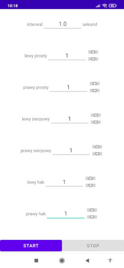
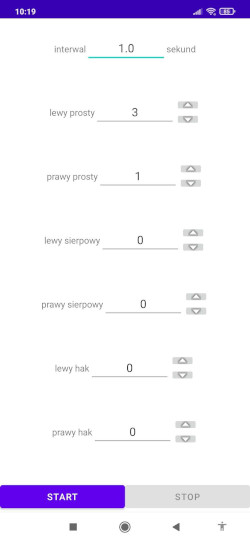

# Dukes Excercise
Aplikacja "Dukes Exercise" została napisana przez mnie przy pomocy Android Studio całkowicie w Kotlinie. Jest dostępna na [Play Store (link)](https://play.google.com/store/apps/details?id=zahenta.dukesexercise). Jeśli wolisz oglądać niż czytać, to, zamiast czytania tego pliku możesz, obejrzeć [to video](https://drive.google.com/file/d/14v1DTA3-rx1C68ehiJzEjY5w-fsN8ktP/view?usp=share_link) na którym pokazuję jak aplikacja działa, jak można jej użuwać.

### Co robi aplikacja
 
Aplikacja służy do trenowania uników przed uderzeniami. Aplikacja losouje jedno z sześciu uderzeń (lewy/prawy prosty/sierpowy/hak), "mówi" nazwę uderzenia, a zadaniem użytkownika jest wykonanie odpowiedniego uniku. W polu "interwał" można ustawić czas między kolejnymi uderzeniami. Przykładowo, jeżeli w polu interwał będzie wpisane 2.0 sekundy, to po wylosowaniu pierwszego uderzenia aplikacja zaczeka 2.0 sekundy, zanim wylosuje drugie uderzenie. 

Użytkownik może wybrać, które uderzenia będą losowane z większym prawdopodobieństwiem, a które z mniejszym. Robi to ustawiając prawdopodobieństwa względne danych ciosów. Aplikacja, po wciśnięciu "Start", sumuje prawdopodobieństwa względne wszystkich ciosów. Następnie, w każdym losowaniu prawdopodobieństwo wylosowania danego ciosu jest równe prawdopodobieństwu względnemu tego ciosu podzielonego przez sumę wszystkich prawdopodobieństw względnych. Przykładowo, po ustawieniu prawdopodobieństw tak jak na powyższym zdjęciu, prawdopodobieństwo wylosowanie każdego uderzenia będzie takie samo, czyli 1/6. Natomiast, po ustawieniu prawdopodobieństw tak jak na poniższym zdjęciu, "lewy prosty" będzie losowany z prawdopodobieństwem 0.75,  "prawy prosty" z prawdopodobieństwem "0.25", a pozostałe ciosy nie będą losowane. 
 

Aplikacja automatycznie zapisuje swój stan ( wartości wszystkich prawdopodobieństw i interwału). Po zamknięciu i otwarciu aplikacji wartości wszystkich prawdopodobieństw i interwału będą dokładnie takie same jak przed zakmnięciem.
